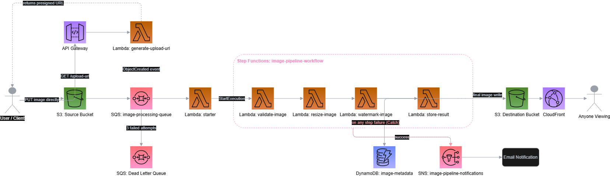
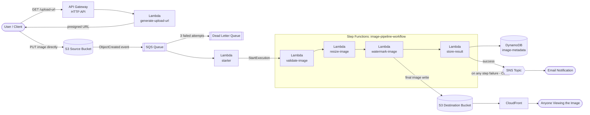

# Serverless Image Processing Pipeline

An event-driven image resize/watermark pipeline built on AWS, submitted as the graduation project for the AWS Solutions Architect Associate track (Manara.tech).

## What it does

A user requests a presigned upload URL through an API, uploads an image directly to S3, and within seconds a resized, watermarked copy is available both in a private destination bucket and via a public CloudFront URL — with metadata recorded in DynamoDB and a notification sent on completion.

## Architecture



<details>
<summary>Mermaid version (renders directly on GitHub, no image needed)</summary>



</details>

## AWS services used

| Service            | Role                                                                                                                                                                                       |
| ------------------ | ------------------------------------------------------------------------------------------------------------------------------------------------------------------------------------------ |
| **S3**             | Source bucket (raw uploads, 7-day expiration lifecycle rule) and destination bucket (processed images, 30-day transition to Infrequent Access + 1-day expiration on orphaned `tmp/` files) |
| **SQS**            | Decouples the S3 upload event from Lambda processing; includes a dead-letter queue                                                                                                         |
| **Lambda**         | Six functions: `generate-upload-url` (presigned URLs), `starter` (kicks off the workflow), and four workflow steps — `validate-image`, `resize-image`, `watermark-image`, `store-result`   |
| **Step Functions** | Standard workflow orchestrating validate → resize → watermark → store as separate states, each with its own `Catch` routing failures to a shared notification step                         |
| **DynamoDB**       | Stores per-image metadata: dimensions, processing status, timestamp                                                                                                                        |
| **API Gateway**    | HTTP API fronting the presigned-URL Lambda                                                                                                                                                 |
| **CloudFront**     | Global CDN in front of the destination bucket, via Origin Access Control (bucket stays private)                                                                                            |
| **SNS**            | Email notification on successful or failed processing — the failure path is a _native_ Step Functions → SNS integration, no Lambda needed for that hop                                     |
| **IAM**            | Least-privilege scoped roles/policies per function and per user — no wildcard `AdministratorAccess`                                                                                        |

## Design decisions (and why)

- **SQS between S3 and Lambda, instead of invoking Lambda directly from an S3 event.** This decouples the producer (upload) from the consumer (processing) — a Lambda failure doesn't lose the event, and the dead-letter queue catches anything that fails repeatedly (3 attempts) for later inspection instead of silently dropping it.
- **Least-privilege IAM throughout**, not `AdministratorAccess`. Each Lambda has its own role scoped to exactly the actions/resources it needs — e.g. `generate-upload-url`'s role can `s3:PutObject` on the source bucket and nothing else; it has no read access, no destination bucket access, no DynamoDB access.
- **CloudFront reads from S3 via Origin Access Control, not a public bucket.** "Block all public access" stays on for both buckets; only CloudFront's specific distribution can read from the destination bucket, via a bucket policy scoped to its ARN.
- **A custom Lambda Layer for Pillow**, built to match Lambda's exact runtime (Python 3.12, x86_64/manylinux2014) rather than relying on a local pip install, since Pillow ships compiled C extensions that must match the target OS/architecture exactly.
- **The pipeline is orchestrated with Step Functions rather than one Lambda doing everything.** Each stage (validate, resize, watermark, store) is its own function, and the state machine — not a try/except block — decides what happens on failure. This means a failure at any stage is immediately visible as a named, isolated state in the execution graph, rather than requiring a stack-trace read to figure out which part of a monolithic function broke.
- **State is passed between steps by reference, not by value.** Step Functions payloads are capped at 256KB, so image bytes can't be threaded through the state machine directly — instead, `resize-image` writes an intermediate file to S3 and passes forward `{bucket, key}` for the next step to read. Same principle as a relay race: pass the baton's location, not the baton.
- **The failure-notification step uses a native Step Functions → SNS service integration**, not a Lambda function. Step Functions can call several AWS services directly from a state definition — using that instead of a dedicated "send an SNS message" Lambda is one fewer function to maintain for a task that's really just a single API call.
- **Each of the six Lambdas has its own least-privilege IAM role**, scoped only to what that specific function does (e.g. `validate-image` can only `GetObject` on the source bucket; it has no write access anywhere, no DynamoDB access, nothing it doesn't need).
- **Lifecycle rules cover both transition and expiration**, on different buckets for different reasons: source-bucket originals expire after 7 days (no purpose once processed), destination-bucket images transition to Standard-IA after 30 days (heavily viewed early, rarely after), and orphaned `tmp/` intermediates expire after 1 day as a safety net in case a mid-pipeline crash ever leaves one behind.

## Testing the pipeline

1. `GET {api-invoke-url}/upload-url?filename=test.jpg` → returns a presigned URL + object key.
2. `PUT` an image to that URL directly (see `curl` example below).
3. Within a few seconds: the destination bucket has a resized/watermarked copy, DynamoDB has a metadata row keyed by the object key, and an email notification arrives.
4. View the processed image globally at `https://{cloudfront-domain}/{object_key}`.
5. In the AWS Console, Step Functions → `image-pipeline-workflow` → Executions tab shows a visual graph of the run — each state (Validate → Resize → Watermark → Store) lights up in sequence, and a failed run highlights exactly which state broke instead of requiring a log dive.

```bash
# Step 1
curl "https://YOUR-API-ID.execute-api.eu-central-1.amazonaws.com/upload-url?filename=test.jpg"

# Step 2 (use the upload_url from the response above)
curl -X PUT "PRESIGNED_URL_HERE" -H "Content-Type: image/jpeg" --data-binary "@test.jpg"
```

## Region

Built in `eu-central-1` (Frankfurt) — chosen for full service availability without opt-in region delays (the geographically closer Bahrain/UAE regions require manual opt-in and, at the time of building, added friction not worth the marginal latency difference for a portfolio-scale project).

## Remaining before submission

- [x] S3 lifecycle rules (transition + expiration, both buckets)
- [x] Demo video recording

## Demo

[Watch the demo video](https://youtu.be/XUiurJWkBlU)
